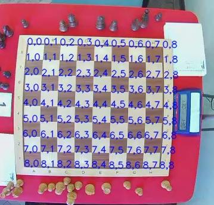

# Broadcast chess games played in a real board to Lichess

Program that enables you to broadcast chess games played in a real chess board to Lichess.  
Using computer vision it will detect the moves made on chess board. It will also try to estimate the clock times.

Based on the work of Alper Karayaman. See https://github.com/karayaman/Play-online-chess-with-real-chess-board and https://github.com/karayaman/lichess-with-a-real-board.

## Installing

First clone this repository and install all dependencies with `pip install -r requirements.txt`

## Camera Setup

0. If you don't know what Index/API to use, you can view all cameras after another with `camera_detector.py --view --all`
  - This will allow you to inspect each stream before pressing ESC to see the next one. At the end,
  the results are printed for each Index and API

1. Make sure you use the right index and API to connect to your camera. `cli.py test` can be useful.
  - You can adjust these settings inside of `config.json`

2. Place your camera near to your chessboard so that all of the squares and pieces can be clearly seen by it. Preferably, it should be above the chess board.

3. Remove all pieces from your chess board.

4. Run `cli.py calibrate`. Check that the corners of your chess board are correctly detected and press key "q" to save detected chess board corners. The program should detect the corners instantly. The square covered by points (0,0), (0,1),(1,0) and (1,1) should be a8. You can rotate the image by pressing key "r" to adjust that. Example chess board detection result:

   

## Usage

1. Place the pieces of the chess board in their starting position.
2. Make sure you create the `initial_games.pgn` file (you can use the provided template).
4. Run `cli.py flask`
5. Run `main.py`.
6. Open `http://127.0.0.1:5000/show` (replace with your flask ip)
7. Make the moves in the real board.
8. Enjoy!

## TODO

- Improve documentation.
- Create an intuitive user interface for multi-board broadcasting.
- Integrate the last move recognition improvements by Alper Karayaman at https://github.com/karayaman/Play-online-chess-with-real-chess-board/commit/a4361304c68f75b88bfefafc904382674a52880c

## Additional features

### 1. Multiple boards

You can use multiple cameras to record multiple boards, by starting different instances of `main.py` using 

   <code>python main.py -c CAMERA_INDEX -g BOARD_NUMBER</code>

Make sure you have previously calibrated each camera with

   <code>python board_calibration.py -c CAMERA_INDEX</code>

### 2. Correct moves and clock times

To correct moves, press U+BOARD_NUMBER, edit `game_{BOARD_NUMBER-1}.pgn` and press Enter.

To correct clock times, press Y+BOARD_NUMBER, enter both times in 'h:mm:ss, h:mm:ss' format and press Enter. You should enter the time each player had after their last move.

## Required libraries

- opencv-python
- python-chess
- numpy
- scikit-image
- berserk
- pynput
